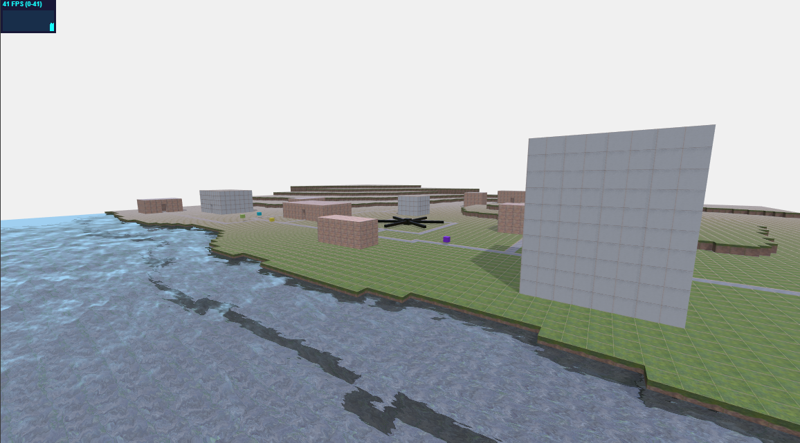
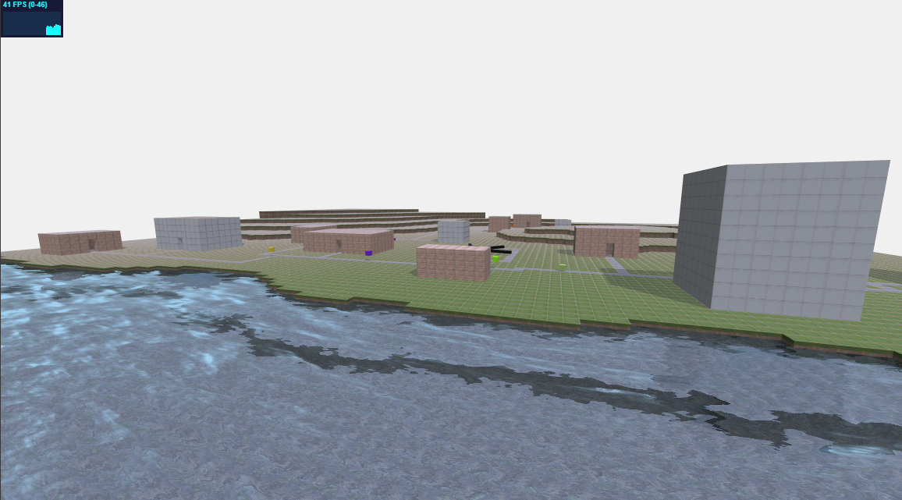
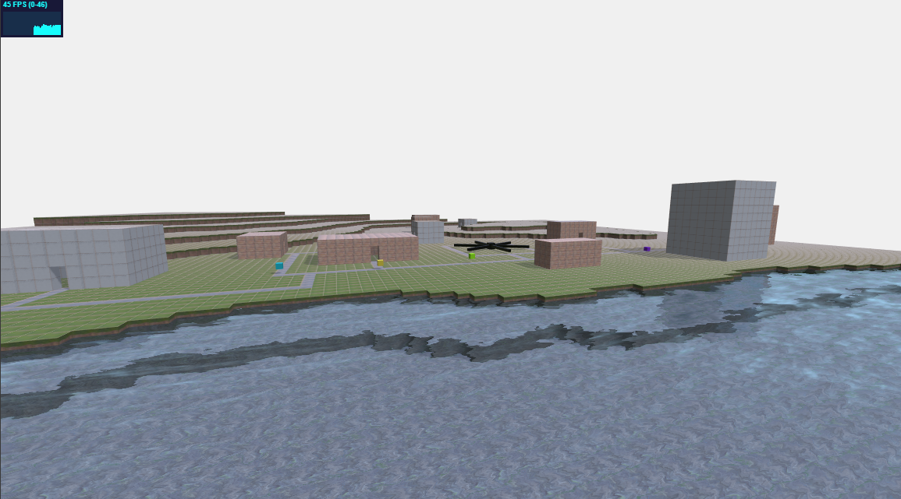
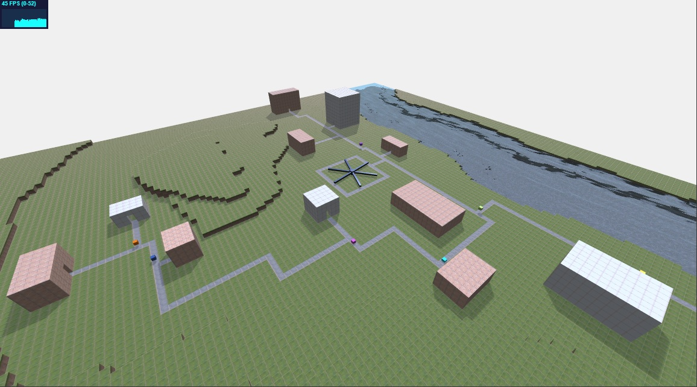

# Report finale

## Attenzione
Da test effettuati la scena non gira su browser Edge in quanto il loader messo a disposizione da ThreeJS per caricare file EXR va in errore.

## Descrizione del progetto
Il progetto è stato pensato per rappresentare un piccolo villaggio con un fiume, delle collinette, una giostra e delle case, collegate da strade su cui saltellano gli abitanti del villaggio.

File del progetto:
* <code>index.html</code>: contiene solamente il codice di inizializzazione
* <code>js/tools.js</code>: contiene una serie di funzioni utilizzate nei vari file del progetto
* <code>js/world.js</code>: contiene i dati e la logica di inizializzazione dell'intera scena, oltre ai processo di update dei componenti e rendering della scena
* <code>js/terrain.js</code>: contiene la procedura di generazione del terreno
* <code>js/path.js</code>: contiene la procedura di generazione della mesh di una strada e le funzioni che permettono di calcolare se un punto appartiene o meno alla strada e le funzioni che permettono, dato un punto, di calcolare il punto successivo oppure precedente sulla strada
* <code>js/house.js</code>: contiene la procedura di generazione della mesh di una casa
* <code>js/abitant.js</code>: contiene la procedura di generazione della mesh di un abitante e la funzione di aggiornamento della sua posizione per poter animare il suo spostamento lungo la strada a cui appartiene
* <code>js/carousel.js</code>: contiene la procedura di generazione della mesh della giostra e la funzione di aggiornamento per la sua animazione
* <code>textures/cloud_layers_1k.exr</code>: texture HDR utilizzata per la riflessione nel materiale metallico della giostra (presa da [HDRI Heaven](https://hdrihaven.com/))
* <code>textures/complete_basecolor.jpg</code>: texture utilizzata per il base color di ogni materiale della scena (tranne che per l'acqua, gli abitanti e la giostra), composta da texture ottenute dal sito [Poliigon](https://www.poliigon.com/)
* <code>textures/complete_roughness.jpg</code>: texture utilizzata per la rugosità di ogni materiale della scena (tranne che per l'acqua, gli abitanti e la giostra), composta da texture ottenute dal sito [Poliigon](https://www.poliigon.com/)
* <code>textures/complete_normal.jpg</code>: texture utilizzata come normal map di ogni materiale della scena (tranne che per l'acqua, gli abitanti e la giostra), composta da texture ottenute dal sito [Poliigon](https://www.poliigon.com/)
* <code>textures/water/*</code>: texture fornite da ThreeJS per il materiale dell'acqua
* <code>lib/*</code>: contiene tutti i file messi a disposizione da ThreeJS

## Risultati
La scena, con gli abitanti che saltellano su e più per la propria strada, è risultata abbastanza carina.
Un problema che però è sorto è il framerate che può risultare abbastanza mediocre, in generale (tra i PC su cui è stata testata la scena) gli FPS si aggirano tra 35 e 60. Questo problema è dovuto soprattuto alla mancata ottimizzazione dei cubi: essendo ogni oggetto composto da tanti cubi, si potrebbero ottimizzare le mesh per andare ad eliminare le facce sempre nascoste (si pensi al terreno dove nella maggior parte della scena è visibile solo la faccia superiore del cubo). Altre possibili ottimizzazioni sarebbero l'utilizzo dell'instancing oppure della voxellizzazione per ridurre ancora il numero di calcoli da effettuare e di dati da gestire.

Il risultato finale si può però vedere nelle immagini sottostanti.

## Processo di realizzazione
Per la realizzazione del progetto sono partito dalla creazione della heightmap utilizzando Photoshop e la relativa interpretazione per la creazione del terreno della scena, questo con lo scopo di darmi un'idea generale di come strutturare il villaggio, facendo in modo che, ad esempio, una strada non passi sopra al fiume oppure ad una collina.
Inizialmente la scena doveva rappresentare una gola tra due montagne, ma sono sorti subito dei problemi di performance dovuti al numero eccessivo di cubi (non ottimizzati).

Successivamente sono passato alla realizzazione delle strade e alla creazione dell'algoritmo che permette, dato un punto, di sapere se giace o meno sulla strada, successivamente utilizzato durante la generazione del terreno per non aggiungere cubi del terrno nella stessa posizione dei cubi della strada in quanto avrebbero generato dei problemi di z-fighting (oltre che dei cubi inutili).

Una volta completate le strade sono passato alla creazione delle case, degli abitanti e della giostra andando anche a definire il loro comportamento nella funzione di update.

Durante tutto questo processo ho sempre continuato ad aggiungere dei "pezzi" alle macro-texture utilizzate nei matriali della scena. L'intera scena infatti utilizza solamente le 4 texture indicate sopra, questo per andare ad ottimizzare il numero di texture da caricare.

Non è stato utilizzato, e di conseguenza creato, alcun asset al di fuori delle texture.

Per lo sviluppo ho utilizzando i seguenti strumenti:
* Visual Studio Code come editor per il codice
* Photoshop come editor di immagini per la creazione della heightmap e delle texture per i materiali
* Chrome come browser per visualizzare e debuggare la scena
* GIT come strumento di versioning